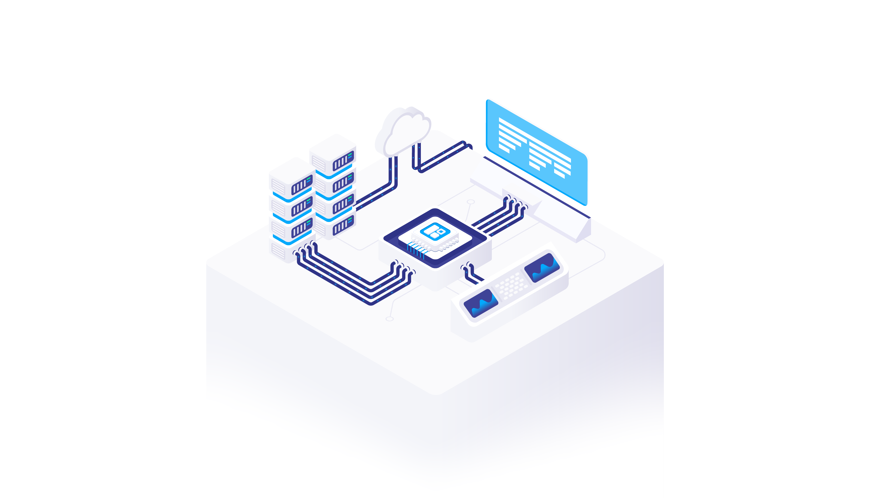

# Prodfiler Documentation

Welcome to the documentation for Prodfiler, the world's first **publicly available distributed
lightweight continuous whole-system profiler**.

In these pages, we strive to provide you with all the information you need to use Prodfiler. If you
find there is anything missing, or have a question not addressed here, please open an issue and
let us know -- we will try to fix it ASAP.

## What is Prodfiler?

Prodfiler is the world's first **distributed lightweight continuous whole-system profiler**. This is
a bit of a mouthful; in practice this means that Prodfiler can answer the question:

> Across a fleet of hundreds or thousands of machines, which lines of code are actually eating how
> much of the overall CPU time? How does this change over time?

Prodfiler is inspired by software available inside some Hyperscalers, most notably Google and
Facebook. Google has an internal system called
'[Google-Wide Profiling](https://research.google/pubs/pub36575/)', which has led to very significant
savings, a culture of performance awareness/improvement, and to long-term developments such as
[SwissTables](https://abseil.io/about/design/swisstables) and even the various hardware offload
designs. Likewise, Facebook runs a system, which is described in
[this talk](https://databricks.com/session_eu19/using-production-profiles-to-guide-optimizations)
from the SPARK AI Summit.

Both Google and Facebook achieve this capability by recompiling all dependencies from scratch and
generally do not make this capability available to the outside world.

Prodfiler is designed to bring the same capability to **everybody** running a Linux Kernel with version 4.15 or higher.

## Why use Prodfiler?

Continuous in-production profiling can provide the following benefits:
 * Make your services faster
 * Reduce your cloud bill (since performance improvements mean fewer instances needed)
 * Identify and debug performance regressions
 * Help identify parts of your software that scale poorly
 * Find out about system daemons and other components that are consuming CPU unexpectedly

As a side effect, you can reduce your CO2 footprint, since savings in CPU consumption translate
pretty directly into savings in power consumption.

## What is so special about Prodfiler?

Prodfiler has a number of unique capabilities not available elsewhere. Find out more on our
[Prodfiler internals](internals.md) page. 

## How do I get started?

Prodfiler deployment is easy: You sign up and create a project; once that is done, you receive
a command line with which you can launch the agent (either manually on a single machine, or via
HELM charts on a K8s cluster, or on a group of ECS nodes, etc.).

Please check the [getting started guide](getting-started.md).

## Details about all features

You can find a detailed overview of all features in our
[Prodfiler feature reference](feature-reference.md).

## FAQ

We have a detailed [FAQ](faq.md) which can answer many of the frequently-asked questions.

## Troubleshooting

If you encounter any problem, check our [troubleshooting](troubleshooting.md) page. If that does
not help, please open an issue and/or contact prodfiler-support@optimyze.cloud

## Supported platforms and dependencies

* Linux x86_64 with kernel version >= 4.15

