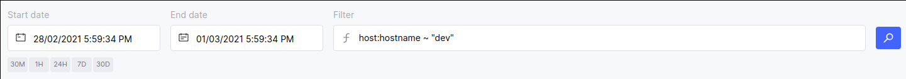

# Querying & filtering results

Profiling results can be restricted to a specific set of hosts in your fleet.

The Prodfiler user interface exposes this functionality through the "Filter" box in the user interface:

## Filter syntax

Conceptually, filtering consists of matching keys against values. Valid keys are defined by Prodfiler and documented below.

* A condition on a given key `key1` must be of the form `key1 ~ "regexp1"` or `key1 = "value1"`.
  The value must be a string in double quotes.
* `~` and `=` are currently the only supported comparison operators.
  Literally, the `~` operator means "matches the following [RE2 regular expression](https://github.com/google/re2/wiki/Syntax)".
  The `=` operator means "matches the following string exactly" (case-sensitive).
* Multiple conditions can be joined with the `AND` boolean operator. For example, the following has a valid syntax:
  `key1 ~ "regexp1" AND key2 ~ "regexp2"`
* Other boolean operators (like `OR`) are not supported at the moment.
* The `NOT` operator can be used to negate a condition, for example:
  `NOT key1 ~ "regexp1"`
* The `NOT` operator takes precedence over `AND`. This means that:
  `NOT k1 ~ "r1" AND k2 ~ "r2"`
  is equivalent to  
  `(NOT k1 ~ "r1") AND k2 ~ "r2"`
* Parentheses can be used freely. However, an `AND` condition cannot be negated with `NOT`. For example, the following is currently rejected:
  `NOT (k1 ~ "r1" AND k2 ~ "r2")`

## A word of caution

Given that `~` operates on RE2 regular expressions, always keep in mind that values in conditions will be interpreted as such.
While `19.*` is a valid regular expression, it will match `192.168.0.1` as well as `10.0.1.19`.

## Keys supported by Prodfiler

There are currently three types of keys that can be provided when filtering:
trace-derived, host-derived and cloud instance-derived keys. Trace-derived keys
filter traces whilst host-derived and cloud instance-derived keys filter hosts.

### Trace-derived keys

**NOTE**: Only the `=` operator is valid for trace-derived keys.

* `trace:comm`: process name.
* `trace:podname`: pod name.
* `trace:deploymentname`: same as podname.
* `trace:containername`: container name.

#### Examples

* To select traces belonging to `python`:
  `trace:comm = "python"`
* To select traces not belonging to `python`:
  `NOT trace:comm = "python"`
* To select traces belonging to pod `podname`:
  `trace:podname = "podname"`

### Host-derived keys

* `host:ip`: the IP address of the machine. When multiple IPs are possible, only one is used: the IP address of the interface through which the Prodfiler traffic is routed.
* `host:hostname`: the hostname of the machine that is running the Prodfiler agent.
* `host:kernel_version`: the output of `uname -r` on the machine.
* `host:kernel_proc_version`: the contents of `/proc/version` on the machine.
* `host:sysctl/kernel.bpf_stats_enabled`: value of kernel parameter.
* `host:sysctl/kernel.unprivileged_bpf_disabled`: value of kernel parameter.
* `host:sysctl/net.core.bpf_jit_enable`: value of kernel parameter.
* `host:tags`: user-specified tags.

User-specified tags can be provided to Prodfiler via command-line (-tags), configuration
file directive (tags) or through an environment variable (PRODFILER_TAGS).
Each tag must match  `^[a-zA-Z0-9-:._]+$` regex and use `;` as a separator.
Invalid tags will be dropped and warnings issued on startup.

Additionally, a number of CPU-derived keys are supported, with a prefix of
`host:cpu/<cpu-idx>/` where `<cpu-idx>` must be a logical CPU index, starting from `0`.
Values for CPU-derived keys are collected from /proc, sysfs and through CPUID:

* `host:cpu/<cpu-idx>/clock/max-mhz`: integer, may not exist on every machine.
* `host:cpu/<cpu-idx>/clock/min-mhz`: integer, may not exist on every machine.
* `host:cpu/<cpu-idx>/clock/scaling-cur-freq-mhz`: integer, may not exist on every machine.
* `host:cpu/<cpu-idx>/architecture`: "x86_64" always.
* `host:cpu/<cpu-idx>/bugs`: comma-separated list of CPU bugs, taken from `/proc/cpuinfo`.
* `host:cpu/<cpu-idx>/flags`: comma-separated list of CPU flags, taken from `/proc/cpuinfo`.
* `host:cpu/<cpu-idx>/model`: taken from `/proc/cpuinfo`.
* `host:cpu/<cpu-idx>/model-name`: taken from `/proc/cpuinfo`.
* `host:cpu/<cpu-idx>/stepping`: taken from `/proc/cpuinfo`.
* `host:cpu/<cpu-idx>/vendor`: taken from `/proc/cpuinfo`.
* `host:cpu/<cpu-idx>/clock/scaling-driver`: Current idle mechanism, taken from `/sys/devices/system/cpu/cpuidle/`.
* `host:cpu/<cpu-idx>/clock/scaling-governor`: Current idle policy, taken from `/sys/devices/system/cpu/cpuidle/`.
* `host:cpu/<cpu-idx>/online`: online cores for given CPU index, taken from `/sys/devices/system/cpu/<cpu-idx>/online`.

#### Examples

* To select hosts with IP starting with `10.1.`:
  `host:ip ~ "^10\.1\."`  
  Note the use of `^` (beginning of line) so that `110.1.0.0` can't match the regular expression, and `\.` (escaped dot) so that `10.123.0.0` doesn't match.
* To select hosts with hostname starting with `prod-` or `dev-`:
  `host:hostname ~ "^(prod|dev)-"`
* To select hosts with Intel CPUs:
  `host:cpu/0/vendor ~ "Intel"`
* To select hosts with user-specified tag containing `alpha:beta`:
  `host:tags ~ "alpha:beta"`

### Cloud instance-derived keys

The following keys are available for all cloud providers and encapsulate information in a convenient format
for filtering:

* `instance:public-ipv4s`: list of all public instance IPs separated by commas.
* `instance:private-ipv4s`: list of all private instance IPs separated by commas.

#### Examples

* To select a host with public IP (any network interface) `1.2.3.4`:
  `instance:public-ipv4s ~ "1\.2\.3\.4"`

#### EC2-derived keys

The following keys are extracted from the AWS EC2 instance metadata service (if they are present):

Refer to the [EC2 documentation](https://docs.aws.amazon.com/AWSEC2/latest/UserGuide/instancedata-data-categories.html) to see the meaning and format of each value.
* `ec2:ami-id`
* `ec2:ami-manifest-path`
* `ec2:ancestor-ami-ids`
* `ec2:hostname`
* `ec2:instance-id`
* `ec2:instance-type`
* `ec2:instance-life-cycle`
* `ec2:local-hostname`
* `ec2:local-ipv4`
* `ec2:kernel-id`
* `ec2:mac`
* `ec2:profile`
* `ec2:public-hostname`
* `ec2:public-ipv4`
* `ec2:product-codes`
* `ec2:security-groups`
* `ec2:placement/availability-zone`
* `ec2:placement/availability-zone-id`
* `ec2:placement/region`
* `ec2:network/interfaces/macs/<MAC>/device-number`
* `ec2:network/interfaces/macs/<MAC>/interface-id`
* `ec2:network/interfaces/macs/<MAC>/local-hostname`
* `ec2:network/interfaces/macs/<MAC>/local-ipv4s`
* `ec2:network/interfaces/macs/<MAC>/mac`
* `ec2:network/interfaces/macs/<MAC>/owner-id`
* `ec2:network/interfaces/macs/<MAC>/public-hostname`
* `ec2:network/interfaces/macs/<MAC>/public-ipv4s`
* `ec2:network/interfaces/macs/<MAC>/security-group-ids`
* `ec2:network/interfaces/macs/<MAC>/security-groups`
* `ec2:network/interfaces/macs/<MAC>/subnet-id`
* `ec2:network/interfaces/macs/<MAC>/vpc-id`
* `ec2:network/interfaces/macs/<MAC>/vpc-ipv4-cidr-block`
* `ec2:network/interfaces/macs/<MAC>/vpc-ipv4-cidr-blocks`

Where `<MAC>` should be a MAC address of form `0a:0b:0c:0d:0e:0f`.

For convenience, EC2 instance tags are also made available for filtering via:

* `ec2:tags/<TAG-KEY>`

Where `<TAG-KEY>` should be an EC2 tag key name.

**NOTE**: In order for EC2 instance tags to be collected, the instance needs
to have an `IAM` role assigned with a policy that allows for `ec2:DescribeTags`.

##### Examples

* To select instances launched from AMI `ami-123456789`:  
  `ec2:ami-id ~ "ami-123456789"`
* To select instances launched in availability zone `eu-west-1a`:  
  `ec2:placement/availability-zone ~ "eu-west-1a"`
* To select the instance with public IP `1.2.3.4`: 
  `ec2:public-ipv4 ~ "^1\.2\.3\.4$"`
* To select the instances tagged with `owner:bar@test.baz`:
  `ec2:tags/owner = "bar@test.baz`

#### GCE-derived keys

The following keys are extracted from the Google Compute Engine instance metadata service (if they are present):

Refer to the [GCE documentation](https://cloud.google.com/compute/docs/metadata/default-metadata-values) to see the meaning and format of each value. 
* `gce:instance/id`
* `gce:instance/cpu-platform`
* `gce:instance/description`
* `gce:instance/hostname`
* `gce:instance/image`
* `gce:instance/machine-type`
* `gce:instance/name`
* `gce:instance/tags`
* `gce:instance/zone`
* `gce:instance/network-interfaces/<iface-idx>/ip`
* `gce:instance/network-interfaces/<iface-idx>/gateway`
* `gce:instance/network-interfaces/<iface-idx>/mac`
* `gce:instance/network-interfaces/<iface-idx>/network`
* `gce:instance/network-interfaces/<iface-idx>/subnetmask`
* `gce:instance/network-interfaces/<iface-idx>/access-configs/<cfg-idx>/external-ip`

Where `<iface-idx>` and `<cfg-idx>` should usually only have `0` as a valid value, unless you are running with a more advanced network configuration.

##### Examples

* To select instances running on a Intel Haswell CPU:  
  `gce:instance/cpu-platform ~ "Haswell"`
* To select instances launched with public IP address starting with `35.227`:  
  `gce:instance/network-interfaces/0/access-configs/0/external-ip ~ "^35\.227"`

#### Azure-derived keys

The following keys are extracted from the Azure instance metadata service (if they are present):

Refer to the [Azure Documentation](https://docs.microsoft.com/en-us/azure/virtual-machines/linux/instance-metadata-service?tabs=windows) to see
the meaning and format of each value.
* `azure:compute/sku`
* `azure:compute/name`
* `azure:compute/zone`
* `azure:compute/vmid`
* `azure:compute/tags`
* `azure:compute/offer`
* `azure:compute/vmsize`
* `azure:compute/ostype`
* `azure:compute/version`
* `azure:compute/location`
* `azure:compute/publisher`
* `azure:compute/environment`
* `azure:compute/subscriptionid`
* `azure:network/interface/<iface-idx>/macaddress`
* `azure:network/interface/<iface-idx>/ipv4/subnet/<sub-idx>/prefix`
* `azure:network/interface/<iface-idx>/ipv4/subnet/<sub-idx>/address`
* `azure:network/interface/<iface-idx>/ipv4/ipaddress/<ip-idx>/privateipaddress`
* `azure:network/interface/<iface-idx>/ipv4/ipaddress/<ip-idx>/publicipaddress`
* `azure:network/interface/<iface-idx>/ipv6/subnet/<sub-idx>/prefix`
* `azure:network/interface/<iface-idx>/ipv6/subnet/<sub-idx>/address`
* `azure:network/interface/<iface-idx>/ipv6/ipaddress/<ip-idx>/privateipaddress`
* `azure:network/interface/<iface-idx>/ipv6/ipaddress/<ip-idx>/publicipaddress`

Where `<iface-idx>` and `<sub-idx>`  should usually only have `0` as a valid value, unless you are running
with a more advanced network configuration. `<ip-idx>` starts from `0` and increases with the number of
IP addresses.

The IPV6 IPs (if present) from all interfaces are also made available through
the following keys:

* `instance:public-ipv6s`: list of all public instance IPs separated by commas.
* `instance:private-ipv6s`: list of all private instance IPs separated by commas.

##### Examples

* To select instances in `westeurope` location:
  `azure:compute/location ~ "westeurope"`

## FAQ

See [here](faq.md#filtering).
