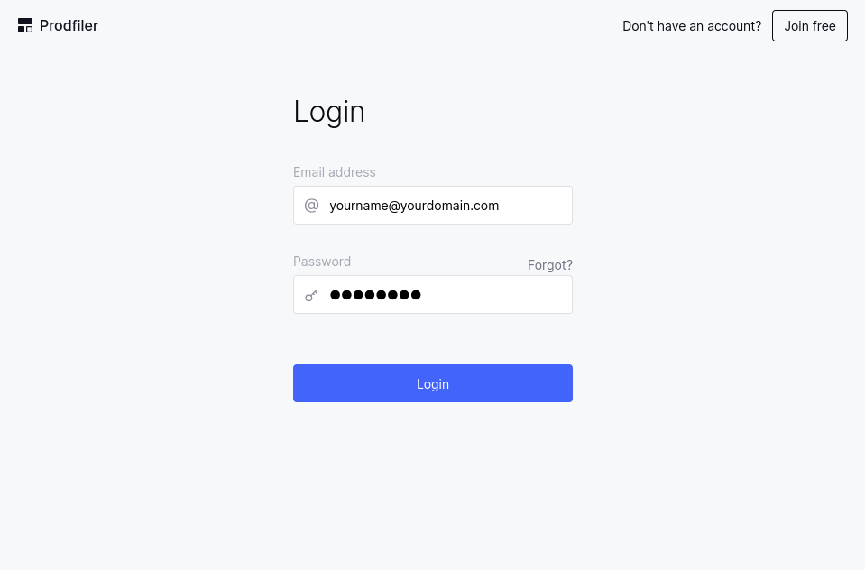
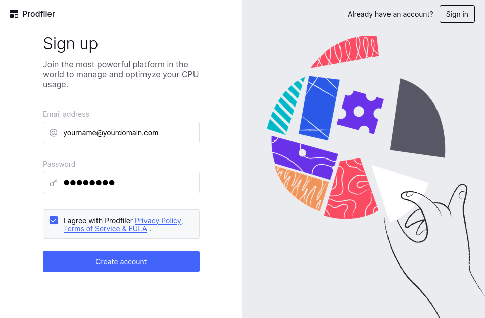
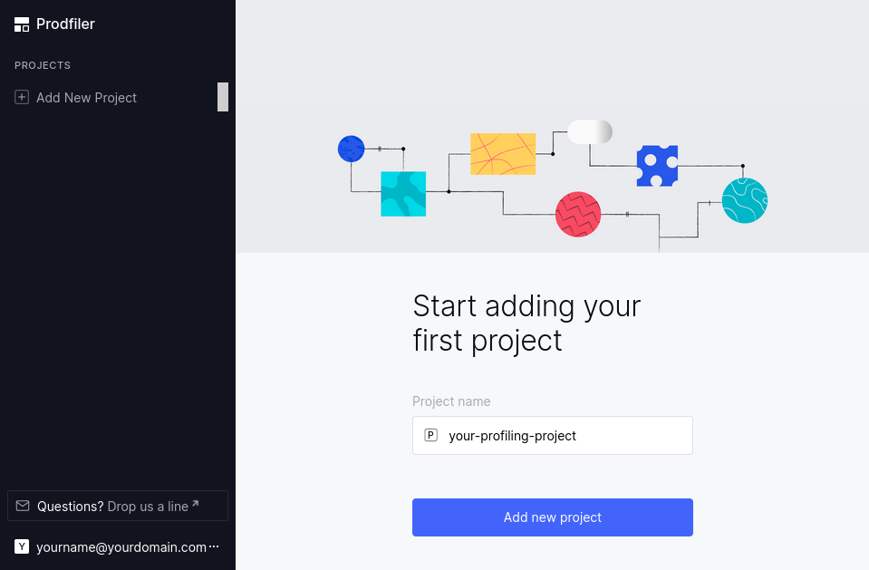
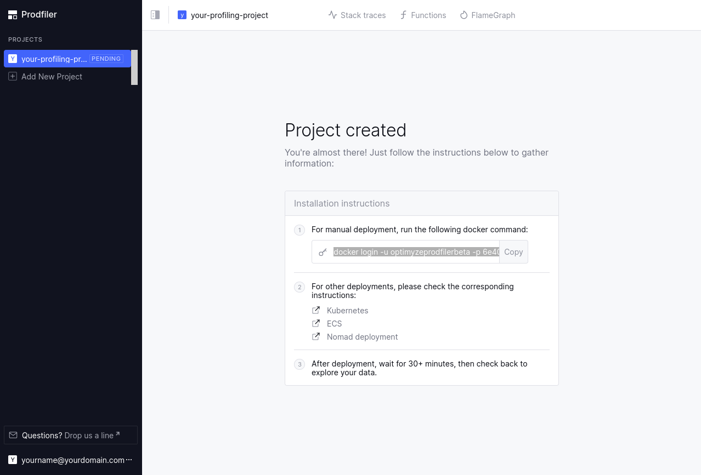

# Getting started with Prodfiler

Getting started with Prodfiler is easy: You create an account and a project, receive instructions
with which you can launch the agent, and 30 minutes after the agent is deployed, you should
have information you can inspect.

## Signing up for an account

Visit the (Prodfiler URL) and click on the "Join free" button on the top right:



Next, create a new account by entering the email address associated with the account and a desired
password:



You can then return to the login page and log in with your email/password combination.

## Creating a new project

Profiling data from a group of machines is organized into a **project**. To get started, simply
enter the name of a project in this screen:



## Installing the profiling agent

Once the project is created, it is in **pending** state - which means that it has not received any
data to analyze or inspect yet. You will be greeted by the below screen, which includes a command
line that you can copy and paste to deploy the agent on individual machines, and links to this
documentation so you can deploy on Kubernetes, ECS, or Nomad.



The command line that is shown looks as follows:

```
docker login -u optimyzeprodfilerbeta -p [XXXX];
docker run --name prodfiler --privileged --pid=host -v /etc/machine-id:/etc/machine-id:ro \
   -v /sys/kernel/debug:/sys/kernel/debug:ro -v /dev/null:/etc/prodfiler/prodfiler.conf \
   -e PRODFILER_PROJECT_ID=[YYYY] \
   -e PRODFILER_SECRET_TOKEN=[ZZZZ] \
   -e PRODFILER_COLLECTION_AGENT=data.try.prodfiler.com:443 \
   optimyze/pf-host-agent:Release-2.0.0 /root/pf-host-agent -t all
```

Let's unpack this: The first line logs you into the `dockerhub` repository that contains the
container `optimyze/pf-host-agent:Release-2.0.0`, and the second line starts this container
with your project ID and a secret token (that you need to keep secret to ensure that others cannot
pollute your project with data) configured as environment variables.
The container needs to be `privileged` because Prodfiler interacts with kernel features that are
typically only available to the `root` user; the volume mounts expose debugging information to the Prodfiler agent.

### Manual installation on a single host

If you wish to deploy the profiling agent to a single host, you can simply copy & paste the above
command line and run it (with the appropriate privileges) on a machine (or a set of machines) you
wish to profile.

### Deploying to a Kubernetes cluster

Please refer to the instructions [here](./kubernetes.md).

### Deploying to a fleet of ECS nodes

Please refer to the instructions [here](./ecs.md).

### Deploying via Nomad

Please refer to the instructions [here](./nomad.md).

### Next steps

After about 30 minutes, you should have a bit of data to [inspect](./feature-reference.md).

