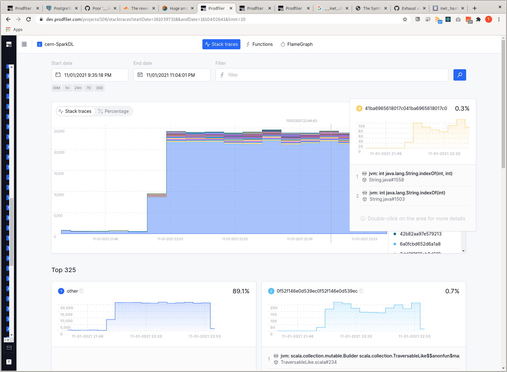
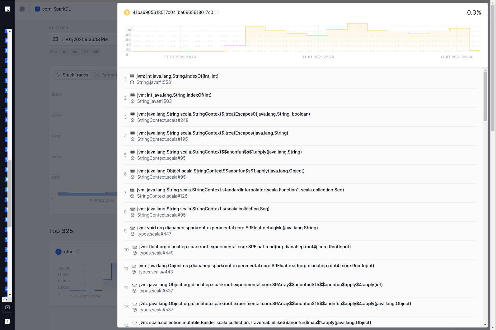
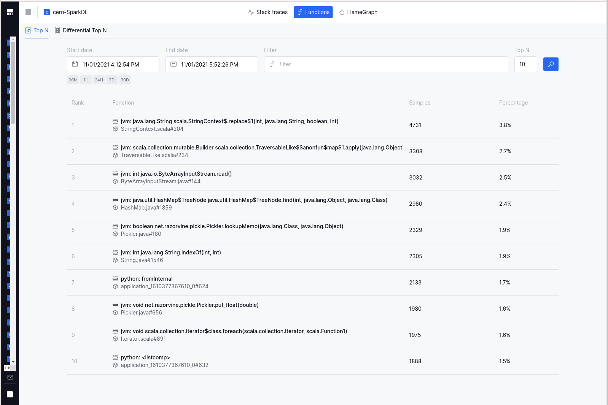
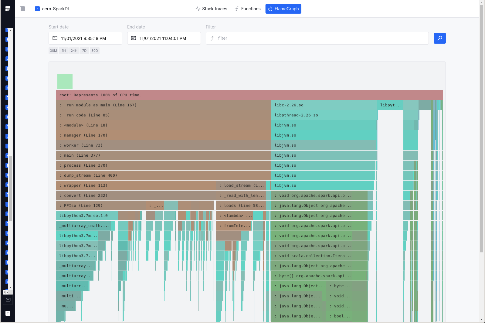
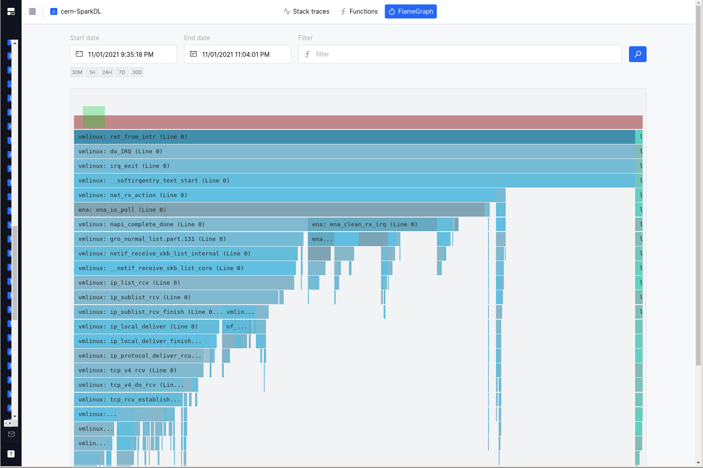
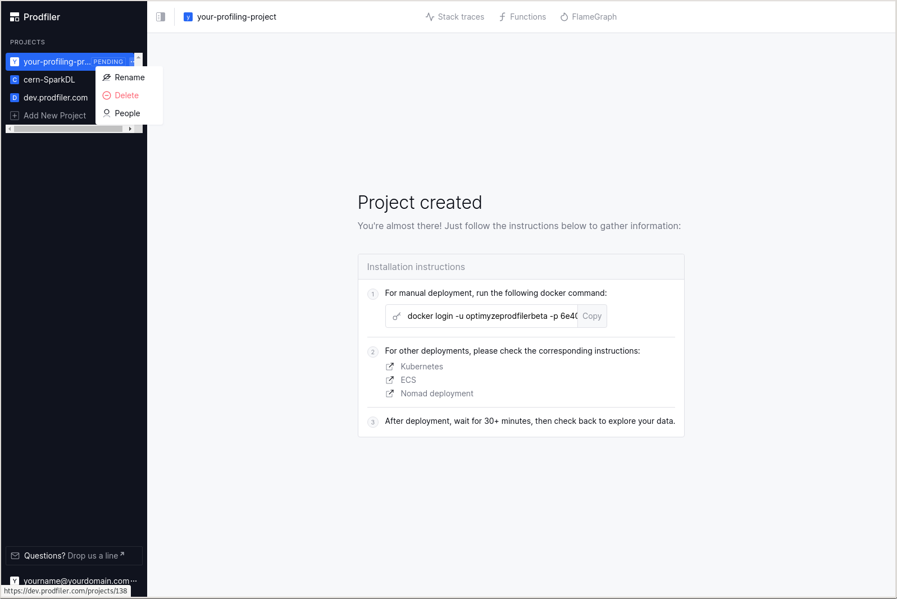
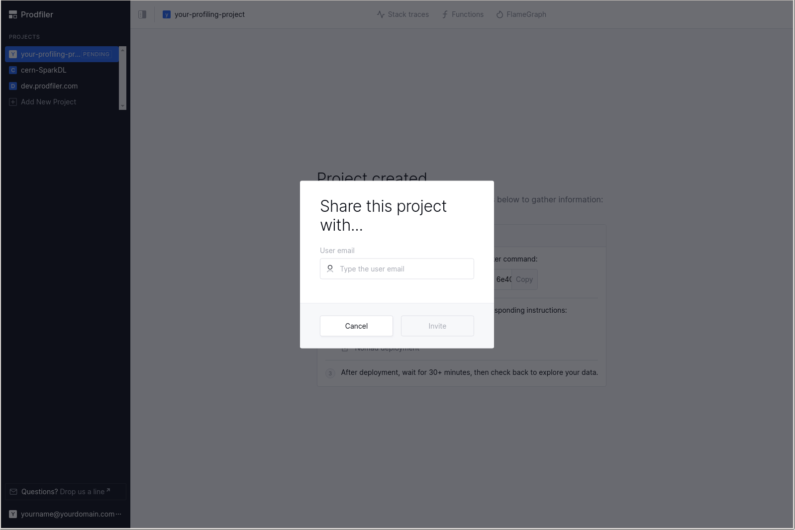
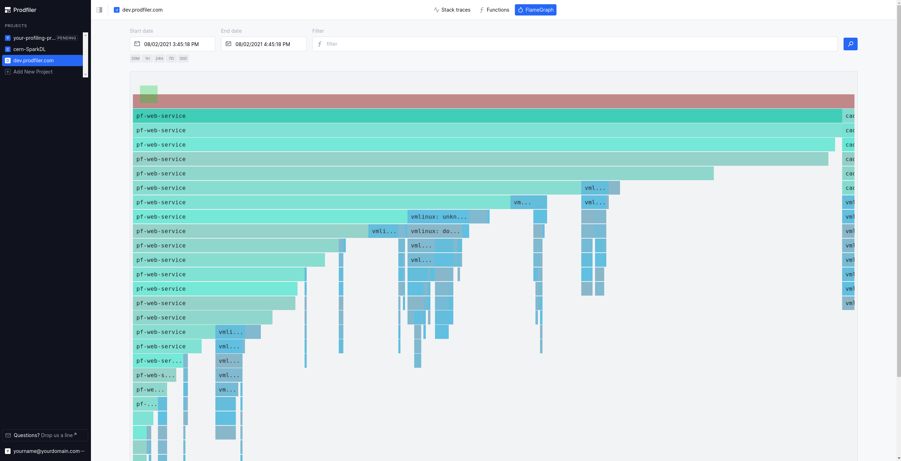

# Getting started with Prodfiler

Getting started with Prodfiler is easy: You create an account and a project, receive instructions
with which you can launch the agent, and 30 minutes after the agent is deployed, you should
have information you can inspect.

## Signing up for an account

Visit the (Prodfiler URL) and click on the "Join free" button on the top right:


Next, create a new account by entering the email address associated with the account and a desired
password:


You can then return to the login page and log in with your email/password combination.

## Creating a new project

Profiling data from a group of machines is organized into a **project**. To get started, simply
enter the name of a project in this screen:


## Installing the profiling agent

Once the project is created, it is in **pending** state - which means that it has not received any
data to analyze or inspect yet. You will be greeted by the below screen, which includes a command
line that you can copy and paste to deploy the agent on individual machines, and links to this
documentation so you can deploy on Kubernetes, ECS, or Nomad.


The command line that is shown looks as follows:

```
docker login -u optimyzeprodfilerbeta -p [XXX];
docker run --name prodfiler --privileged --pid=host -v /etc/machine-id:/etc/machine-id:ro \
   -v /sys/kernel/debug:/sys/kernel/debug:ro -v /dev/null:/etc/prodfiler/prodfiler.conf \
   -e PRODFILER_PROJECT_ID=[YYYY] \
   -e PRODFILER_SECRET_TOKEN=[ZZZZ] \
   -e PRODFILER_COLLECTION_AGENT=dev.prodfiler.com:10000 \
   optimyze/pf-host-agent:release-beta-1 /root/pf-host-agent 
```

Let's unpack this: The first line logs you into the `dockerhub` repository that contains the
container `optimyze/pf-host-agent:release-beta-1`, and the second line starts this container
with your project ID and a secret token (that you need to keep secret to ensure that others cannot
pollute your project with data) configured as environment variables.
The container needs to be `privileged` because Prodfiler interacts with the kernel features that are 
typically only available to the `root` user; the volume mounts expose debugging information to the Prodfiler agent.

### Manual installation on a single host

If you wish to deploy the profiling agent to a single host, you can simply cut & paste the above
command line and run it (with the appropriate privileges) on a machine (or a set of machines) you
wish to profile.

### Deploying to a Kubernetes cluster

Please refer to the instructions [here](./kubernetes.md).

### Deploying to a fleet of ECS nodes

Please refer to the instructions [here](./ecs.md).

### Deploying via Nomad

Please refer to the instructions [here](./nomad.md).

## Inspecting the stack traces

After about 30 minutes, you should have a bit of data to inspect, so when you return to Prodfiler,
you will arrive in the "stack trace" view: This is a view of all stack traces recorded over time.


Normally, you will have a large chunk (80%+) of traces in the category "other" (which means they
are quite rare individually, and are grouped into a big chunk), and a few hundred stack traces
shown in the "Top XXX" list below.

The UI subdivides the time interval that you are looking at into smaller chunks, and for each time
chunk Prodfiler retrieves the top-50 most common stack traces. These are then displayed in the
diagram. Because each time chunk may have a different top-50-most-common stack trace, you may end
up with a few hundred stack traces that are made explicit (e.g. not grouped into the "other"
category).

The number of traces collected at a given point in time is correlated to overall CPU load - an idle
machine will generate fewer traces than a machine running at full load, as cores sent to sleep will
not generate traces in Prodfiler.

Clicking on one of the "30M", "1H", "24H", "7D", "30D" buttons will switch the web interface to
display the current point in time minus 30 minutes, 1 hour, etc.

Click-and-drag into the chart allows you to drill down on a particular timeframe. Single-click on
a block in the diagram will pull up the last two stack frames associated with that trace, providing
a bit more context -- a double-click will pop up a window with all stack frames of the trace.




## Inspecting the Top-N functions

Aside from inspecting the most common traces, you can also inspect the most common **functions**.
Simply click on the "functions" button in the top navigation bar. The time interval you have
already selected will stay the same.




## Comparing the Top-N functions between two time intervals

It can often be helpful to compare two timeframes or subsets of machines - identifying which
functions got relatively more expensive or relatively less expensive. In the "differential Top-N"
view, you can do just that: Specify two different time frames (or two different subsets of machines
using the filter language), and see which functions got more expensive or less expensive.


## Inspecting and browsing the Flamegraph

Flamegraphs are a common way of visualizing collections of stack traces. By clicking on the
"Flamegraph" button in the top navigation bar, the construction of a flamegraph is triggered on
the backend, and the result will be loaded in the browser. **Please note that this is a somewhat
heavy operation, and it can take 30s or longer to generate and load a flame graph**.

The runtimes to which a particular stack frame belongs are marked by different colors: Brown-ish
hues represent python, mint-ish hues represent native userspace code, green-ish hues are JVM, and
blue-ish hues are from the Linux kernel.





Your mousewheel should allow navigating the flamegraph on the vertical axis; clicking on individual
frames will re-scale the flamegraph to make the frame the center of the screen. Clicking on an
already-selected frame will pop up a window that provides estimates for the overall CPU consumed
by the frame in question - both in the selected timeframe, but also annualized under the assumption
that the current workload is representative.

The cost and CO2 estimates are based on assumptions that are documented in the 
[feature reference](feature-reference.md).

## Filtering the results

Please refer to the instructions [here](./filtering.md).

## Sharing your project with other users

You can share a single project among multiple users by clicking on the three dots to the right of
the project name and selecting "People":




You will need to write the full email address of the other user you wish to share the project
with.

# Dealing with missing symbols

By default, Prodfiler should symbolize stack frames for upstream binaries from the Ubuntu and Debian
package repositories.

For many other executables, it may happen that Prodfiler does not immediately have access to the
symbols in question. This will be visible in the stacktraces and flamegraphs:



In order to provide symbols to Prodfiler, please use the bash script located in 
[./scripts/upload_symbols.sh](https://github.com/optimyze/prodfiler-documentation/blob/main/scripts/upload-symbols.sh).

Please be aware that this process can take some time: Even if the symbols are
present in our backend, there can be a signficant lag (up to 30 minutes) between the backend having
the symbols and the corresponding frames being symbolized properly.

## Unstripped Golang binaries

For unstripped Golang binaries, the easiest way to get the stack frames symbolized is simply running
```
./upload_symbols.sh -u [your email address] -d ./[the executable in question]
```

**Please note that this sends the binary to our backend infrastructure! Do not do this if you
are not comfortable with the executable being processed and stored outside of your infrastructure.**

## Stripped Golang binaries

Stripped Golang binaries still retain a lot of the relevant information in the `.gopclntab` section.
This means you can submit the symbols from these executables by doing

```
./upload_symbols.sh -u [your email address] -d ./[the executable in question] -p
```

This has some downsides: In particular, cgo frames will likely not be symbolized as result. Whenever
possibly, try to provide full DWARF symbols.

## Unstripped C/C++ binaries

Unstripped C/C++ binaries can be uploaded just like unstripped Golang binaries.

## C/C++ binaries with separate DWARF file

Many Linux distributions (but also some build systems) generate the DWARF information into a
separate ELF file. This is the default on Debian and Ubuntu-based systems.

```
./upload_symbols.sh -u [your email address] -d ./[the executable in question] -g ./[dwarf file]
```

## Stripped C/C++ binaries

Sometimes it is difficult to get any DWARF information for an already-deployed binary. We are
working on a solution that - in extreme circumstances - can be used to import symbols from a
*similar* executable, e.g. the same software and version compiled from scratch. Please reach out
if you have a need for this so we can prioritize the development accordingly.


