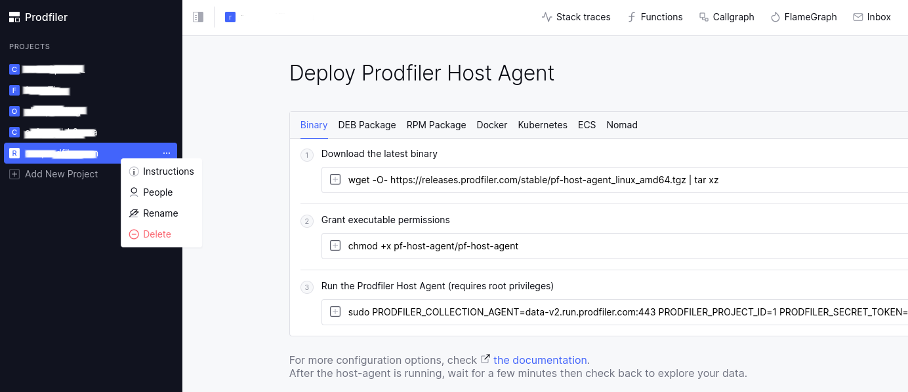

# Upgrading Prodfiler host-agent

The upgrade process varies highly depending on the type of installation.

The Prodfiler UI project menu `Project > Instructions` contains the project-specific data that _may_ be needed to perform an upgrade.

Find below a list of upgrade instructions for each supported platform.

### Binary installation

Use the commands provided in the UI in the `Instructions` menu, switching the `Binary` tab.

### Docker container

Use the commands provided in the UI in the `Instructions` menu, switching to the `Docker` tab.

### OS package in .deb format

Use the commands provided in the UI in the `Instructions` menu, switching to the `DEB Package` tab.

### OS package in .rpm format

* Download the latest stable release visiting [the stable release page](https://releases.prodfiler.com/stable/index.html).
* Run the upgrade without changing any configs
        
      sudo rpm --upgrade pf-host-agent-*.rpm

* Check logs, the version of host-agent is displayed at the start of the output

      sudo journalctl -xu pf-host-agent

### Kubernetes

If you installed via Helm following the instructions in the UI, without any customizations to namespace or release name,
you can upgrade with:
    
    PRODFILER_VERSION=$(curl -s https://documentation.prodfiler.com/latest-release.md)
    helm -n prodfiler upgrade pf-host-agent --set version=${PRODFILER_VERSION} \
      --set "collectionAgentHostPort=data-v2.run.prodfiler.com:443"

If you did apply different settings for your environment, verify them first and then set the new `version` and 
`collectionAgentHostPort` Helm values.  

### ECS

Depending on how you manage ECS tasks, you should upgrade the container image tag of the host-agent.
You can do so via the ECS console in the browser, the AWS CLI or any other tool that keeps track of your configuration changes.

In general, these steps are required to upgrade the `DAEMON` task

* find the right ECS task that holds the host-agent configuration: if you used the instructions, it will be named `optimyze-prodfiler` 
* in the ECS task configuration JSON, find the host-agent version, defined as the `"image": "optimyze/pf-host-agent:<CURRENT_VERSION>"` field
* replace the tag with the new image version from the `Instructions` menu
* update the task definition
* watch the events of ECS task to ensure the containers are being replaced with the new ones

### Nomad

You should perform a [rolling update](https://learn.hashicorp.com/tutorials/nomad/job-rolling-update) of the host-agent job.
Note that the update configuration is not included in the job provided by the UI, so you'll have to amend it. 

If you followed the instructions from the UI to install Prodfiler host-agent, you can get an up-to-date `prodfiler.nomad`
job definition using the commands from the UI, then:

* inspect the plan for the changes
      
      nomad job plan prodfiler.nomad

  the plan _should_ contain only the container image upgrade, but if you applied custom configurations, you may have to 
  adjust the `prodfiler.nomad` file 

* if you are happy with the changes, perform the update

      nomad job run prodfiler.nomad
